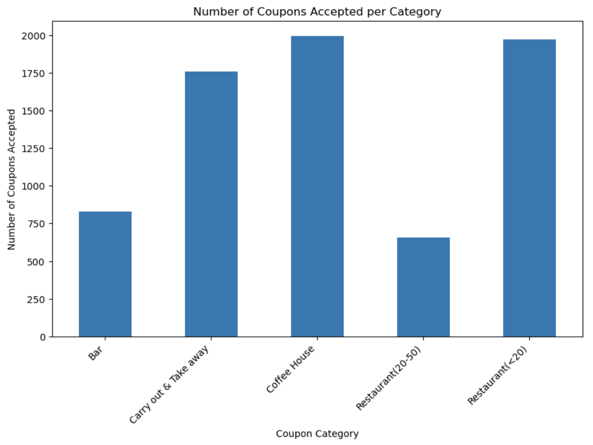
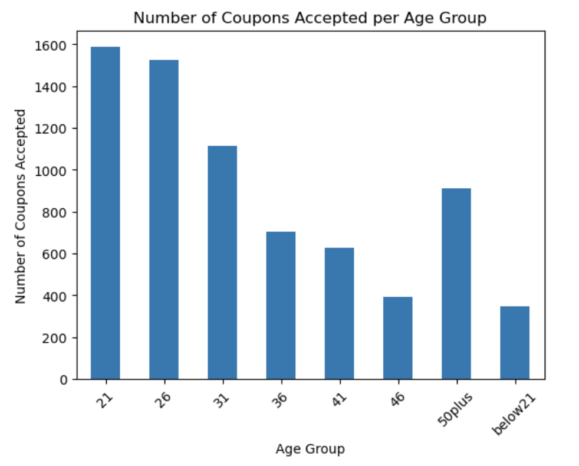
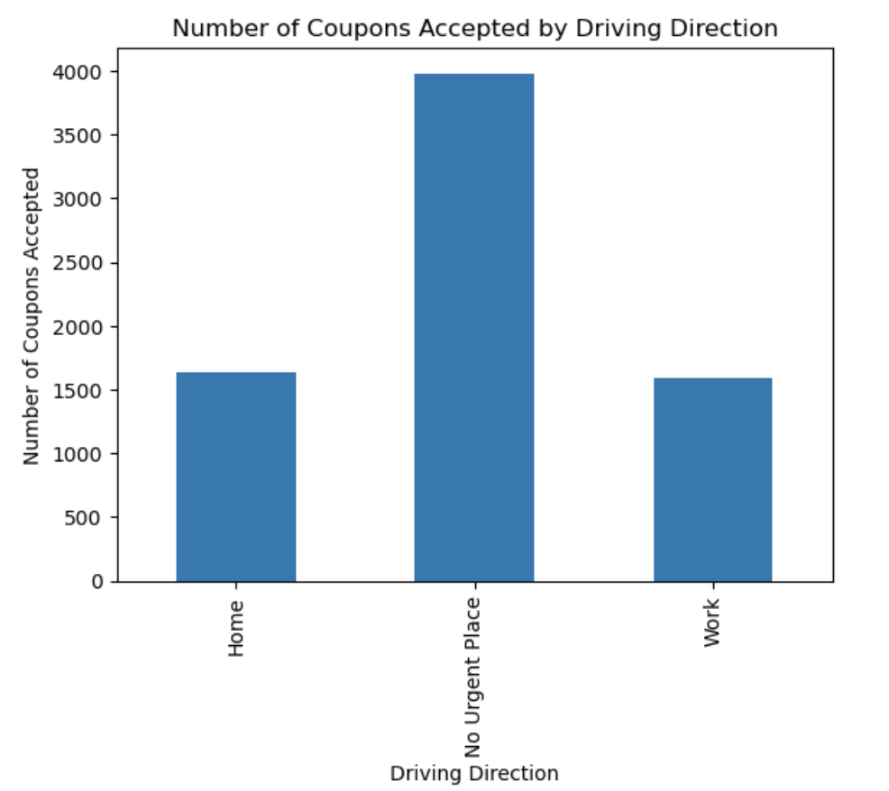

# Customer-Accept-the-Coupon

## Introduction
This project contains exploration of the Coupons data in here [Coupon Data](data/coupons.csv) to find out the different patterns on when a customer accepts the coupons.

## Data cleanup
For the data clean up we cannot just drop the rows with null fields since that would drop a lot of rows considering there are around 12k null values for car field
Fields that are having null values are car, bar, coffeehouse, CarryAway, RestaurantLessThan20. After examining the unique values for each of the fields they have a value of never. Decided to set all the null values to never.

## Some Visualizations

## Conclusion
Other patterns and visualizations can be referred here in this  [Notebook](prompt.ipynb)
